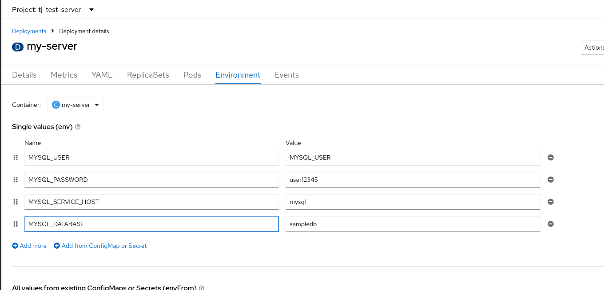

# rahti-2-express-server
Testing express server to connect MySQL in Rahti2.

##
```
npm init -y

npm install mysql
npm install express --save
npm install mysql --save
```


List the services in the project to find the MySQL service.

```
oc get svc
```


3. **Environment Variables**:
- `MYSQL_SERVICE_HOST`: Hostname or IP of MySQL server.
- `MYSQL_USER`: MySQL user.
- `MYSQL_PASSWORD`: Password for MySQL user.
- `MYSQL_DATABASE`: MySQL database name.


Deploy this project in Rahti2

```
 oc new-app https://github.com/jemaltahir/rahti-2-express-server.git --name server --strategy=docker
```


And also deploy msql from rahti


